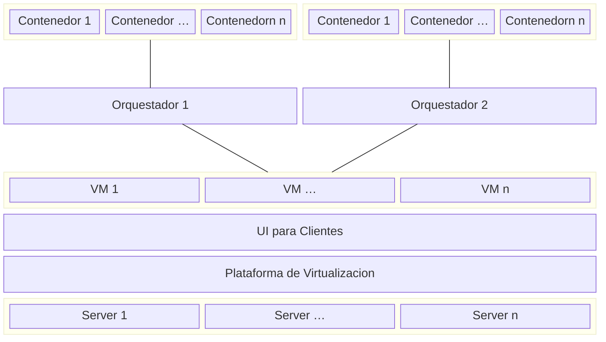
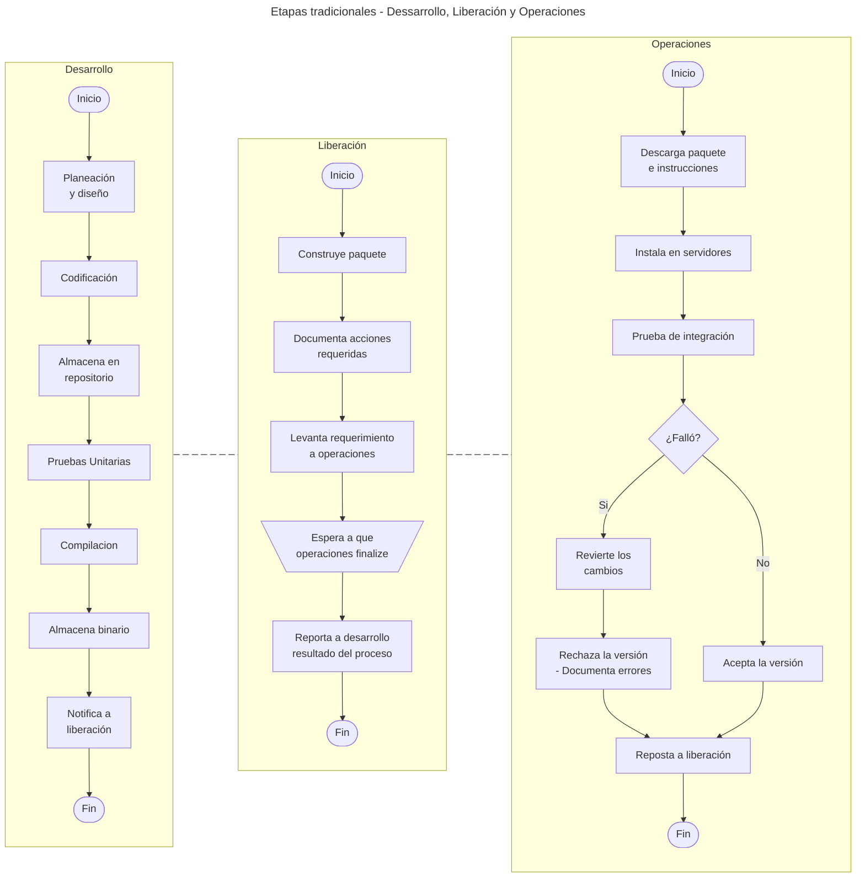
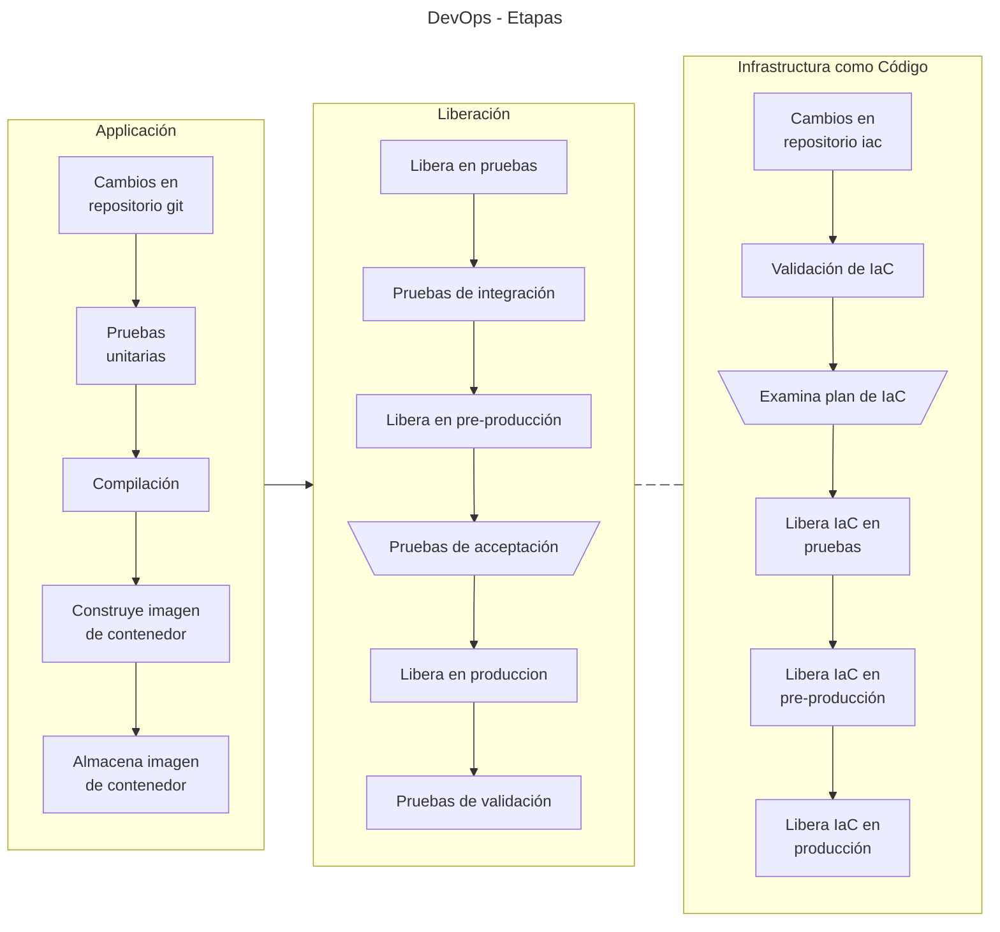

# DevOps In-Formation T1 Ep.1

## Contenedores en la "NUBE" - Diagrama simplificado

```mermaid
block
  columns 6
  block:nsp1:3
    columns 3
    or1cn1["Contenedor 1"]
    or1cne["Contenedor …"]
    or1cnn["Contenedorn n"]
  end
  block:nsp2:3
    columns 3
    or2cn1["Contenedor 1"]
    or2cne["Contenedor …"]
    or2cnn["Contenedorn n"]
  end
  space:6
  or1["Orquestador 1"]:3
  or2["Orquestador 2"]:3
  space:6
  block:env1:6
    columns 3
    hv1vm1["VM 1"]
    hv1vme["VM …"]
    hv1vmn["VM n"]
  end
  con1["UI para Clientes"]:6
  vrt1["Plataforma de Virtualizacion"]:6
  block:dc1:6
    columns 3
    dc1srv1["Server 1"]
    dc2srve["Server …"]
    dc1srvn["Server n"]
  end
  env1 --- or1
  env1 --- or2
  or1 --- nsp1
  or2 --- nsp2
```

## Areas que conforman DevOPS

```mermaid
---
title: Etapas tradicionales - Dessarrollo, Liberación y Operaciones
---
flowchart LR
  subgraph dev["Desarrollo"]
    direction TB
    dev_start([Inicio])
    dev_stop([Fin])
    plan[Planeación<br/>y diseño]
    code[Codificación]
    repo[Almacena en<br/>repositorio]
    utest[Pruebas Unitarias]
    build[Compilacion]
    store[Almacena binario]
    notify_rel[Notifica a<br/>liberación]
  end
  subgraph rel[Liberación]
    direction TB
    rel_start([Inicio])
    rel_stop([Fin])
    build_rel[Construye paquete]
    document_rel[Documenta acciones<br/>requeridas]
    raise_ticket[Levanta requerimiento<br/>a operaciones]
    wait[\Espera a que<br/>operaciones finalize/]
    report_dev[Reporta a desarrollo<br/>resultado del proceso]
  end
  subgraph ops["Operaciones"]
    direction TB
    ops_start([Inicio])
    ops_stop([Fin])
    get[Descarga paquete<br/>e instrucciones]
    install[Instala en servidores]
    itest[Prueba de integración]
    fail{¿Falló?}
    rollback[Revierte los<br/>cambios]
    reject[Rechaza la versión<br/>- Documenta errores]
    accept[Acepta la versión]
    report_rel[Reposta a liberación]
  end

  dev r1@-..- rel r2@-..- ops
  r1@{ animate: true }
  r2@{ animate: true }
  dev_start --> plan --> code --> repo --> utest --> build --> store --> notify_rel --> dev_stop
  rel_start --> build_rel --> document_rel --> raise_ticket --> wait --> report_dev --> rel_stop
  ops_start --> get --> install --> itest --> fail
  fail --> |Si|rollback --> reject --> report_rel
  fail --> |No|accept --> report_rel
  report_rel --> ops_stop
```

```mermaid
---
title: DevOps - Etapas
---
flowchart LR
  subgraph app["Applicación"]
    direction TB
    app_repo[Cambios en<br/>repositorio git]
    u_test[Pruebas<br/>unitarias]
    build[Compilación]
    buildx[Construye imagen<br/>de contenedor]
    registry[Almacena imagen<br/>de contenedor]
  end
  subgraph deploy["Liberación"]
    direction TB
    deploy_testing[Libera en pruebas]
    i_test[Pruebas de integración]
    deploy_staging[Libera en pre-producción]
    a_test[\Pruebas de acceptación/]
    deploy_prod[Libera en produccion]
    v_test[Pruebas de validación]
  end
  subgraph iac["Infrastructura como Código"]
    direction TB
    iac_repo[Cambios en<br/>repositorio iac]
    validate_iac[Validación de IaC]
    plan_iac[\Examina plan de IaC/]
    deploy_iac_testing[Libera IaC en<br/>pruebas]
    deploy_iac_staging[Libera IaC en<br/>pre-producción]
    deploy_iac_prod[Libera IaC en<br/>producción]
  end

  app --> deploy r1@--- iac 
  r1@{ animate: true }
  app_repo --> u_test --> build --> buildx --> registry
  deploy_testing --> i_test --> deploy_staging --> a_test --> deploy_prod --> v_test
  iac_repo --> validate_iac --> plan_iac --> deploy_iac_testing --> deploy_iac_staging --> deploy_iac_prod
```

