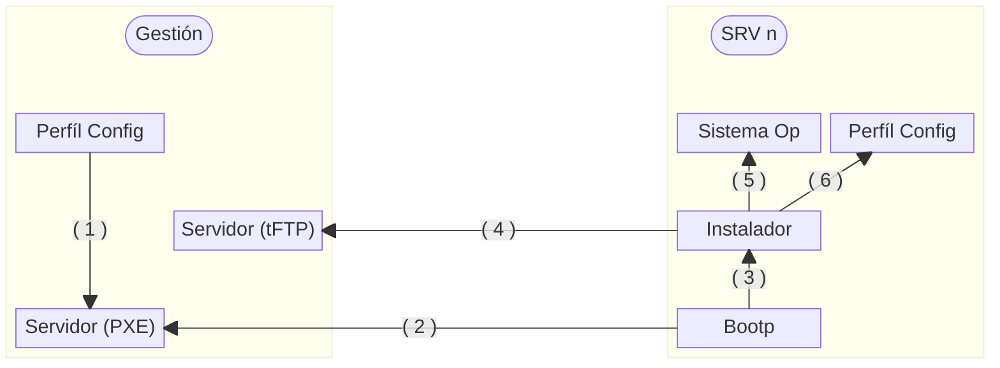
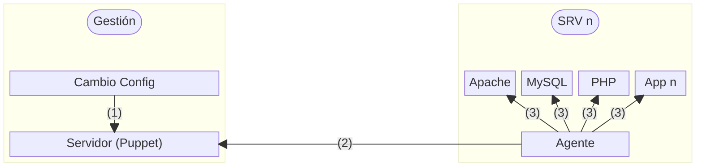
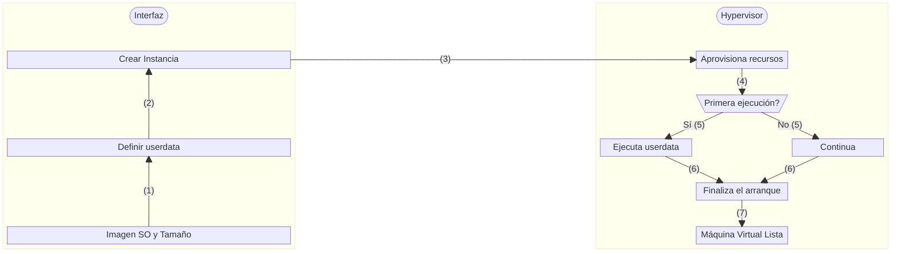
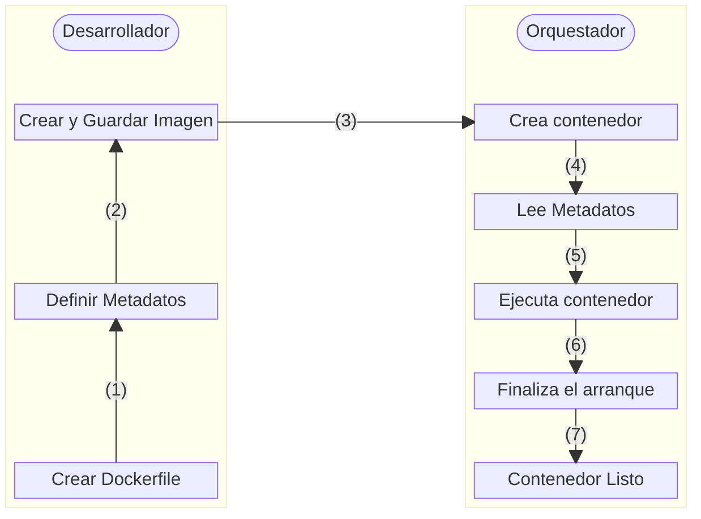
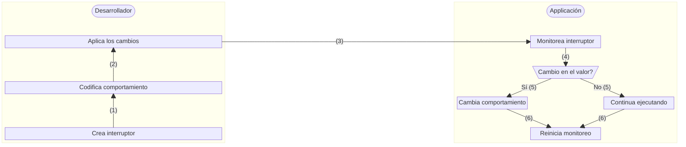

# DevOps In-Formation T1 Ep.2

## Desplazamientos

En DevOps existe el concepto de desplazamiento, el cual implica el desplazar la responsabilidad hacia un lado u otro.

Desplazar la responsabilidad a la izquierda refiere a: realizar las tareas en etapas tempranas del ciclo, mientras que desplazar a la derecha refiere a las estapas finales.

Algunos ejemplos del desplazamiento a la izquierda (Shift Left) son:

- Pruebas unitarias
- Pruebas de integracion
- Uso de contenedores
- Escaneos de seguridad
- Integracion/Despliegue Continuos (CI/CD)

Mientras que los ejemplos del desplazamiento a la derecha (Shift Right) son:

- Pruebas A/B
- Liberaciones Canario
- Despliegue Azul-Verde (Blue-Green)
- Interruptores (Banderas) de funciones

## Gestión de la configuración - Evolución

### Aprovisionamiento de Servidores (Físicos)

### Gestión de configuración de servicios

### Aprovisionamiento de Máquinas Virtuales

### Construcción de Imagenes de Contenedores

### Interruptores de funciones

